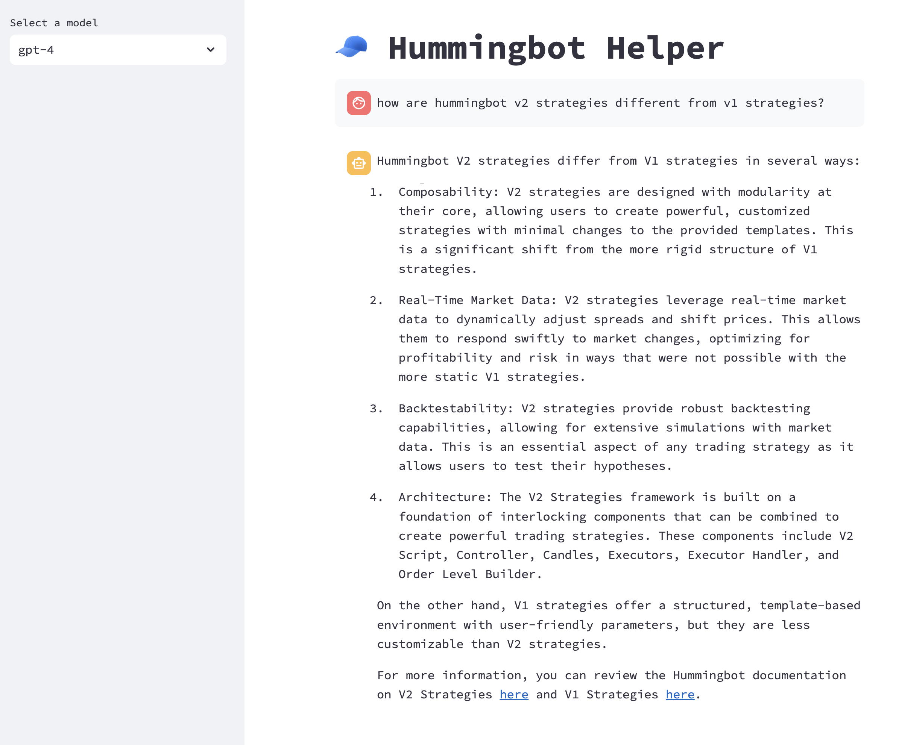

# ai-assistant
## Overview

Welcome to the Hummingbot LLM Research Notebooks repository! This repository is dedicated to exploring, testing, and refining the use of Large Language Models (LLMs) in enhancing the functionality and user experience of Hummingbot. Our primary focus is on developing preprocessing techniques and effective LLM chains to assist users in running bots and efficiently answering questions related to Hummingbot's documentation.

Hummingbot is an open-source software that enables users to create and manage automated trading bots for cryptocurrency markets. As the complexity of trading strategies and the diversity of markets grow, the need for advanced, AI-driven assistance becomes increasingly essential. This repository serves as a collaborative platform for researchers, developers, and Hummingbot enthusiasts to contribute and benefit from the integration of LLMs with Hummingbot.

Join us in this exciting journey to integrate cutting-edge LLM technologies with Hummingbot and revolutionize the way we interact with trading tools! 🚀🤖💹

## Getting Started

To get started with this repository:

1. Clone the repository to your local machine.
2. Install the required dependencies listed in `environment.yml` by running `conda env create`. This creates a new `ai-assistant` conda environment.
3. Activate the created conda environemnt: `conda activate ai-assistant`.
4. Open the `.env` file in a text editor and replace `placeholder` variable with your OpenAI API key:

```
OPENAI_API_KEY=placeholder
```

## Explore the notebooks

Check out the [Explain Documentation notebooks](./research_notebooks/explain_documentation/) contains a set of Jupyter notebooks. These notebooks help you create a vector database based on the current Hummingbot documentation and use it in conjunction with OpenAI models in a basic Retrieval-Augmented Generation (RAG) pipeline.

Run `jupyter notebook` to use the notebooks directly, or access them in Pycharm or VSCode. Explore them to understand the current state of our research. Feel free to modify them and experiment with your own questions.

## Run the app

After you have run through [the first notebook](./research_notebooks/explain_documentation/01_load_hummingbot_docs.ipynb) that creates a vector database based on the Hummingbot docs, you can also test out RAG-based prompts using a test Streamlit app.

Start the app with:
```
streamlit run main.py
```



Note that your OpenAI API key and docs vector database needed to be present for the app to work.

## License

This project is licensed under the [MIT License](LICENSE) - see the LICENSE file for details.

## Disclaimer

This repository is for research and educational purposes only. Any scripts or code should not be used for trading cryptocurrency without understanding the risks involved.

## Contact

For any queries or discussions, please open an issue in this repository, and we will get back to you as soon as possible.

## Contributing

We warmly welcome contributions from the community! If you have ideas, code, bug reports, or enhancements, please feel free to open an issue or submit a pull request. For detailed guidelines on how to contribute, please refer to our [Contribution Guidelines](https://hummingbot.org/developers/contributions/).

